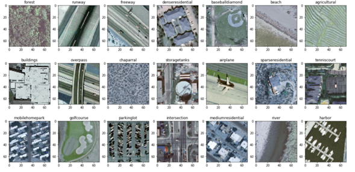
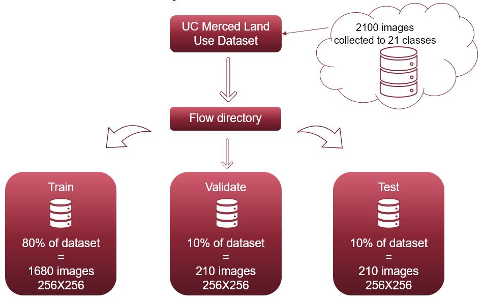
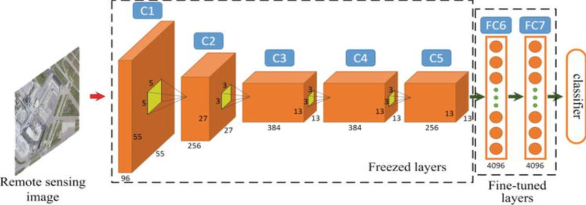
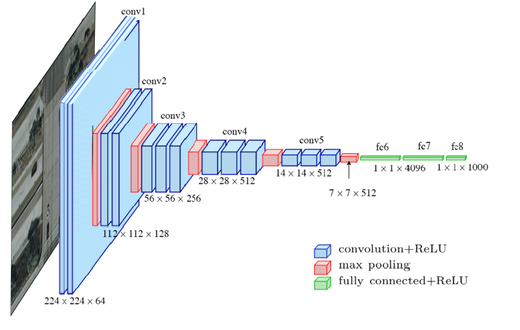
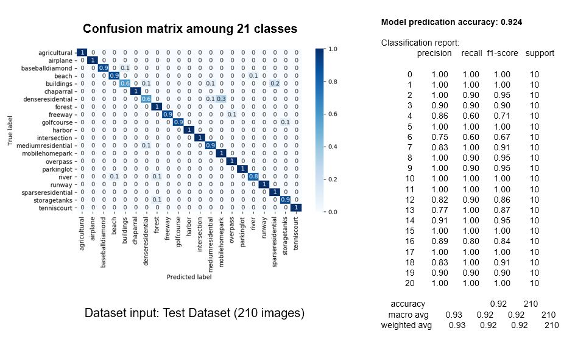

# Classification for land use images via Convolution Neural Network
This project is based on task to classify images come from UCMerced Land Use Dataset. This
Dataset is composed by many images that are satellite imagery. Thus the dataset is composed by 21 different class. Two neural network have been used:
- Pretrained model VGG16 (Transfer Learning)
- Convolution Neural Network
The result will be represented by confusion matrix and accuracy.

#The dataset 
The images were manually extracted from large images from the USGS National Map Urban Area Imagery collection for various urban areas around the country. The pixel resolution of this public domain imagery is 1 foot.  http://weegee.vision.ucmerced.edu/datasets/landuse.html

# The flow of the project

# Convolution Neural Network(CNN)
The use of a Convolution Neural Network (CNN) allows us to extract the essential information to categorize the images provided by the satellite coming from certain points on the earth.
The Convolution Neural Network is composed by: 4 convolution layer with dropout stage.
The input of the model has as shape 256x256x3 
After training the mode is able to predict one of 21 label thank to last dense layer with softmax as activation function. 
The Trainign was performed going to 50 to 200 epochs and Adam as optimizer.

# Transfer Learning(VGG16)
The transfer learning has been performed by VGG model provided by keras library using weights from imagenet.
The last layer has been truncated and joined with fully-connected classifier. Thus the bootleneck features are extracted from pre-trained model VGG16 and used for input and output of the fully-connected model in order to strat the training phase.
The training was performed by an first trainign phase with 50 epochs using training dataset and validate dataset as training set and validate set. Then an second phase was performed by using the concatenation of training and validation set.

# Results
Confusion matrix: (21 labels)

## Run The Main Project (CNN)
The first phase in order to run this project is to run the file "run_preprocessing" in order to extract the zip dataset UCMerced_LandUse and create the flow folder that contains the train/test and validate dataset. 
You can download the DATASET UCMerced Land Use going to link http://weegee.vision.ucmerced.edu/datasets/landuse.html.
Then run this code (cmd) specify as parameter the path of dataset downloaded:
- python run_preprocessing.py (if the dataset is inside to data with this name (UCMerced_LandUse.zip))
Or
- python run_preprocessing.py --path_dataset "the path of dataset zip".

Then, once you have the dataset splitted, you can run to cmd, once you are to principal folder, this code:
- python cnn.py (with values as default mode: evaluation and path for testing : path of bind)
This code has two parameters:
- mode: that represent the modality of call: train or evaluation. For train you start to train the cnn and save the weights and model to
folder which is in default to system (models/model_cnn). Is important that the - path_dataset_train and - path_dataset_val
are set in order to train the cnn with your datasets choosen.
- path_dataset_test: the path of dataset that you want evaluate as test with weights saved. (evaluation/testing)
- path_dataset_train: the path of dataset that you want to take for training (training)
- path_dataset_val: the path of dataset that you want to take for validation (training)

This code can be also runned using a personal dataset. Thus in this case you hae to specify the paths of testing/training and validate dataset of images.

Thus, you can also run the VGG model with this command (cmd);
- python vgg.py --mode evaluation --dataset test 
or 
- python vgg.py --mode evaluation (default path of test already created (/flow..))
or 
- python vgg.py --mode train (default paths already specify for training and validation)

## The principal steps to run the project (CMD)
Thus, the steps to run this project are:

1) Check if you have the dataset in format zip.
    Then run this code (cmd) specify in to the parameter the path of dataset downloaded:
    - python run_preprocessing.py (if the dataset is inside to data with this name (UCMerced_LandUse.zip))
    Or
    - python run_preprocessing.py --path_dataset "the path of dataset zip"

2) Then run cnn in evaluation form (weights already trained):

    - python cnn.py 
    Or
    - python cnn.py --mode evaluation --path_dataset_test "the path of your personal dataset for testing"
    Or 
    - python cnn.py --mode train (take datasets for training and valuation from dir "flow")
    Or
    - python cnn.py --mode train --path_dataset_train "the path of your personal dataset for training" --path_dataset_val "the path of your personal dataset for validate"
     
    ATTENTION: your personal dataset must contain all the 21 classes which are also contained in the original Dataset UCMerced Land Use.
3)  Then, if you want , run the VGG model (transfer learning):
    
    ATTENTION:, in order to run  VGG you have to have the "flow" folder with dataset splitted into train/test/validate 
    
    - python vgg.py --mode evaluation (default paths already specify)
    or 
    - python vgg.py --mode evaluation --dataset "the path to take data to evaluate model (test/train/val)"(default paths already specify)
    or
    - python vgg.py --mode train (default paths already specify for training and validation)
    

## Contact
my email: vannolimarco@hotmail.it
